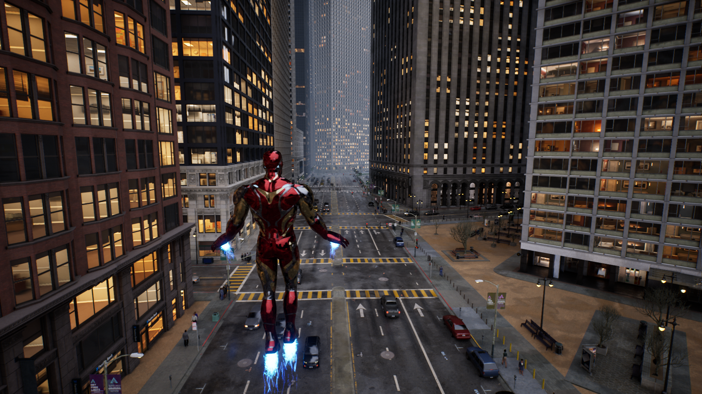
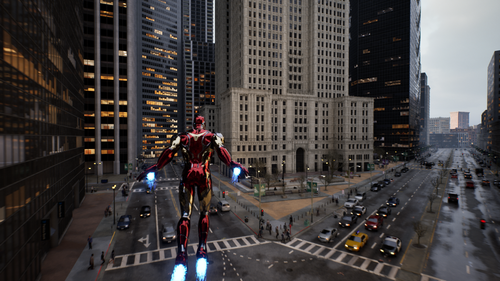
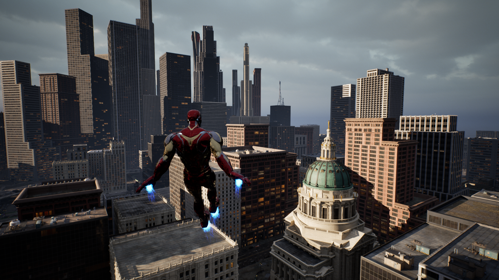
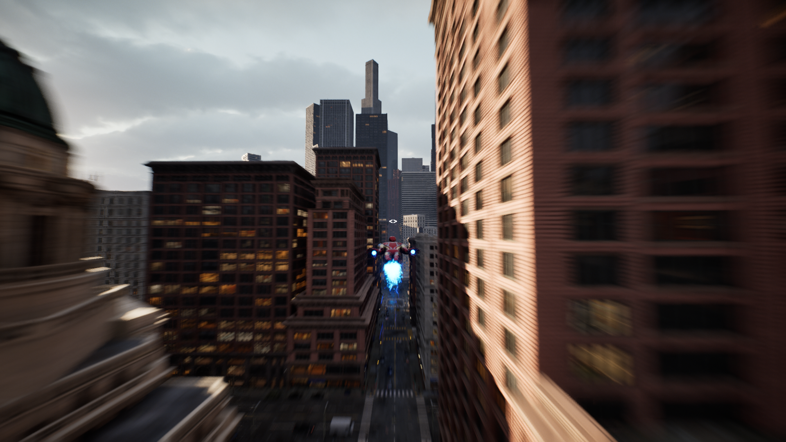

## The project 🚀
My first project with Unreal Engine 5. It is part of my learning and training of the engine. It is exclusively made in blueprints. The player can walk and fly across a realistic city (based on Epic's City Sample) as well as use 3 weapons : the famous repulsor, a classic missile and the powerful chest energy beam 💥

When flying, the player can trigger a boost mode and an hyperboost mode to fly faster and feel Iron-Man's power.

All the animations excepts the walking ones were made by me using an AI-powered motion capture tool : Plask.ai. I filmed myself doing the moves I wanted Iron-Man to do and the tool computes on the video to create an animation. Finally, I just have to use UE5's Rig retargetting tool to be able to use those animations on my desired skeleton.

This is still work-in-progress, I am working to finish the project soon and I plan to make a cool presentation video. So for the moment, I only have a few screenshots to showcase 😉

## Gallery 🖼️
|||
:-------------------------:|:-------------------------:
| The player can move in all the 8 directions | With tailor-made animation for each |

|||
:-------------------------:|:-------------------------:
| The character always look in the camera's direction | I tried to get a nice speed sensation when Hyperboosting |
